 

## 🚀 About Me

- 🎓 Final-year **Computer Science & Engineering** student at **Daffodil International University (DIU)**
- 🔬 Researching **BanglaPlantNet** — an attention-based CNN for real-field crop disease detection in Bangladesh — as my Final Year Design Project
- 👕 Founder and developer of **[TTT Outfit](https://tttoutfit.bd)**, a Bangladeshi streetwear brand; designed and built its e-commerce platform end-to-end
- 🍽️ Built **[Mess Manager](https://mess-manager.app)**, an installable PWA that automates meal tracking, bazar costs, deposits, and monthly settlements for shared living spaces
- 🌐 Designing and maintaining a personal portfolio site powered by a custom admin CMS
- ⚡ Passionate about AI/ML, explainable AI, and full-stack web development
- 💬 Fluent in Bengali and English
- 📫 Open to interesting collaborations — feel free to reach out

 

## 🛠️ Skills

<table>
<tr>
<td valign="top" width="50%">

**Languages**

**Frontend**

**Backend & Database**

</td>
<td valign="top" width="50%">

**AI / Machine Learning**

**Computer Graphics**

**Data Structures & Algorithms**

**Tools & Platforms**

</td>
</tr>
</table>

 

## 📌 Featured Projects

| Project | Highlights |
|:---|:---|
| 🌾 **BanglaPlantNet** | Attention-based CNN for real-field crop disease detection, trained on a locally collected Bangladeshi dataset — Final Year Design Project at DIU |
| 💼 **[Ariful-Portfolio](https://github.com/ariful-arif-232/Ariful-Portfolio)** | Personal portfolio site with a fully custom admin CMS · React, Vite, TypeScript, Tailwind CSS, Supabase |
| 🍽️ **[Mess Manager](https://github.com/ariful-arif-232/mess-manager)** — [Live ↗](https://mess-manager.app) | Installable PWA for shared living spaces with Admin/Member roles, meal tracking, bazar costs, deposits, and monthly settlements · Supabase Postgres + Auth, RLS-secured |
| 👕 **[TTT Outfit](https://github.com/ariful-arif-232/ttt-outfit)** — [Live ↗](https://tttoutfit.bd) | End-to-end e-commerce platform built for my own Bangladeshi streetwear brand · Node.js, Express, EJS, MongoDB |
| 💳 **[student-payment-management](https://github.com/ariful-arif-232/student-payment-management)** | Console-based finance system for student accounts, dues, and clearance, built with Doubly Linked Lists, Queues, and Arrays in C |
| 🏬 **[inventory-sale-retail](https://github.com/ariful-arif-232/inventory-sale-retail)** | Web application for managing retail inventory and sales |

 

## 📊 GitHub Stats

 

## 📈 Contribution Activity

 

💡 *Building useful things, one commit at a time.*

